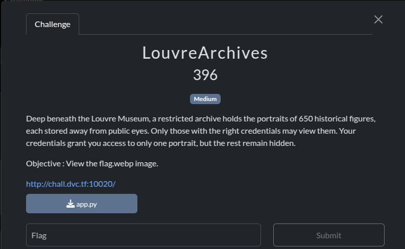
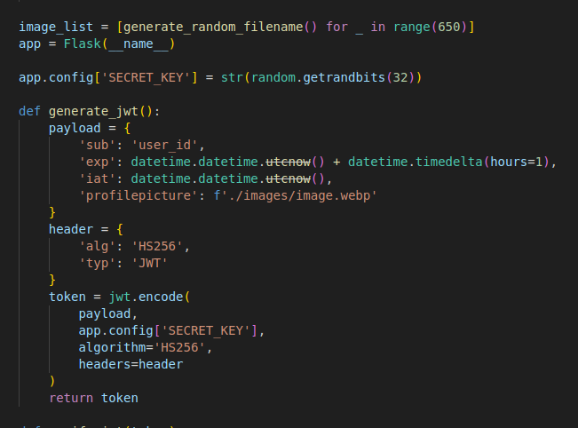
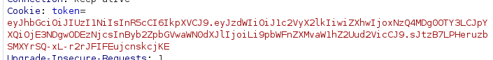
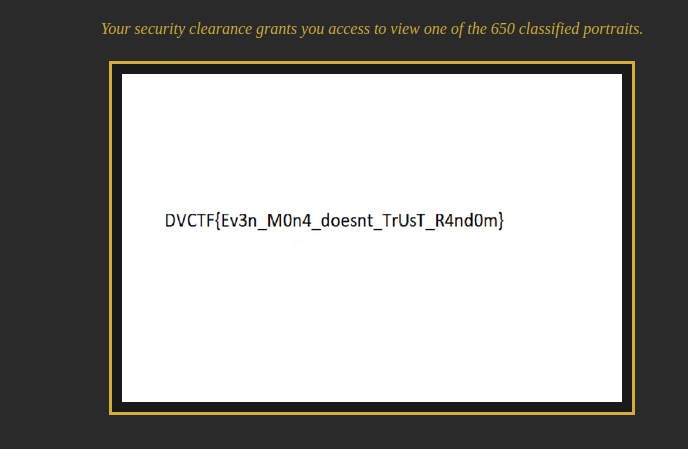

Dans ce chall  il faut acceder flag.webp et on le code source.

En explorant un peu la page, j’ai remarqué une longue chaîne encodée en base64. Une fois décodée et réorganisée, elle contenait plusieurs images `.webp` portant des noms étranges comme `1991781613.webp`, `1273827392.webp`, etc.

En consultant le code source :



On comprend que les noms des fichiers sont générés avec `getrandbits(32)` de Python, c’est-à-dire 32 bits aléatoires produits par la fonction `random.getrandbits`.

Ce qui est intéressant ici, c’est que cette fonction utilise le **générateur Mersenne Twister**, un PRNG (Pseudo-Random Number Generator) **non cryptographiquement sûr**.

---

### 🧠 Study time: le Mersenne Twister

Le **Mersenne Twister** est un générateur pseudo-aléatoire très utilisé (par exemple, par défaut dans le module `random` de Python).  
Il génère des entiers de 32 bits à partir d’un **état interne de 624 entiers de 32 bits**. Une fois cet état connu, tous les nombres suivants peuvent être **prédits avec précision**.

Mais il y a un piège : les valeurs générées sont "temperées" (tempérées), c’est-à-dire transformées par une fonction pour améliorer leur distribution.  
Pour reconstituer l’état interne, il faut **"détermer"** (untamper) les valeurs.

---

### 🔓 Exploitation

Puisqu’on peut **voir plus de 624 fichiers `.webp` nommés avec `getrandbits(32)`**, on a suffisamment de sorties pour reconstruire l’état interne du générateur.

J’ai utilisé ce repo :  
👉 [https://github.com/kmyk/mersenne-twister-predictor](https://github.com/kmyk/mersenne-twister-predictor)

Ce qu’il fait :

1. Il prend **624 sorties** (les noms de fichiers en l’occurrence),
2. Applique l’**algorithme d’"untempering"** pour retrouver l’état original,
3. Permet ensuite de **prédire les futures valeurs** du générateur.

Grâce à ça, on retrouve la **clé secrète utilisée pour signer les JWT** :

`1991781613`

---

### 🎟️ Création d’un JWT forgé

À partir de cette clé, on peut créer un JWT customisé avec comme image de profil la fameuse image `flag.webp` :


```python
import jwt, datetime

secret = '1991781613'

payload = {
    'sub': 'user_id',
    'exp': datetime.datetime.utcnow() + datetime.timedelta(hours=1),
    'iat': datetime.datetime.utcnow(),
    'profilepicture': './images/flag.webp'
}

token = jwt.encode(
    payload,
    secret,
    algorithm='HS256',
    headers={'alg':'HS256','typ':'JWT'}
)

print(token)
```

---

### 📦 Récupération du flag

On remplace le cookie JWT dans Burp:



Et on obtient :

