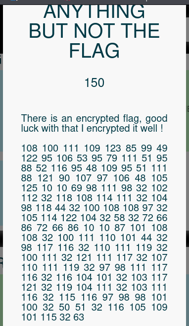

## **Étape 1 : Analyse de l'énoncé**



Le challenge nous donne une série de **nombres en ASCII** et une phrase intrigante :


`108 100 111 109 123 85 99 49 122 95 106 53 95 79 111 51 95 88 52 116 95 48 109 95 51 111 88 121 90 107 97 106 48 105 125 10 10 69 98 111 98 32 102 112 32 118 108 114 111 32 104 98 118 44 32 100 108 108 97 32 105 114 122 104 32 58 32 72 66 86 72 66 86 10 10 87 101 108 108 32 100 111 110 101 44 32 98 117 116 32 110 111 119 32 100 111 32 121 111 117 32 107 110 111 119 32 97 98 111 117 116 32 116 104 101 32 103 117 121 32 119 104 111 32 103 111 116 32 115 116 97 98 98 101 100 32 50 51 32 116 105 109 101 115 32 63`

---

## **Étape 2 : Décodage de l'ASCII**

J'ai utilisé **DCode** pour convertir les nombres ASCII en texte.

**Sortie du décodage ASCII :**


```
ldom{Uc1z_j5_Oo3_X4t_0m_3oXyZkaj0i}
Ebob fp vlro hbv, dlla irzh : HBVHBV
Well done, but now do you know about the guy who got stabbed 23 times ?
```

La dernier phrase semble être un **indice** mentionnant "le gars qui s'est fait poignarder 23 fois", ce qui pourrait être une **référence historique**. 


### **Analyse :**

- `ldom{Uc1z_j5_Oo3_X4t_0m_3oXyZkaj0i}` ressemble à un flag mais est probablement chiffré.
- `"Well done, but now do you know about the guy who got stabbed 23 times ?"` donne un **indice important** : **ROT23**.

---

## **Étape 3 : Déchiffrement ROT23**

J'ai utilisé **DCode** pour appliquer **ROT23** au flag.

**Sortie du ROT23 :**


```
ogrp{Xf1c_m5_Rr3_A4w_0p_3rAbCndm0l}
Here is your key, good luck : KEYKEY
Zhoo grqh, exw qrz gr brx nqrz derxw wkh jxb zkr jrw vwdeehg 23 wlphv ?
```

### **Analyse :**

- Le flag est toujours chiffré.
- Une nouvelle phrase apparaît : **"Here is your key, good luck : KEYKEY"**.
- On a donc une **clé ("KEYKEY")** pour un chiffrement **basé sur une clé**.

---

## **Étape 4 : Déchiffrement Vigenère**

J'ai essayé **plusieurs algorithmes classiques** qui utilisent une clé, et **le chiffrement Vigenère** a donné un bon résultat.

J'ai utilisé **DCode** en entrant **ogrp{Xf1c_m5_Rr3_A4w_0p_3rAbCndm0l}** et la clé **KEYKEY**.

📌 **Sortie :**

`ectf{Th1s_i5_Th3_W4y_0f_3nCrYpti0n}`

---

## **🎯 Conclusion**

🔹 **Le challenge était un double chiffrement :**

1. **ROT23** (référence historique à César)
2. **Vigenère** (avec la clé donnée après ROT23)

🔹 **Le flag final :**

`ectf{Th1s_i5_Th3_W4y_0f_3nCrYpti0n}`


---

✅ **Leçon apprise :**  
Toujours tester les **chiffrements classiques** (ROT, César, Vigenère) et **chercher des indices cachés** (comme "23" ici pour ROT23).