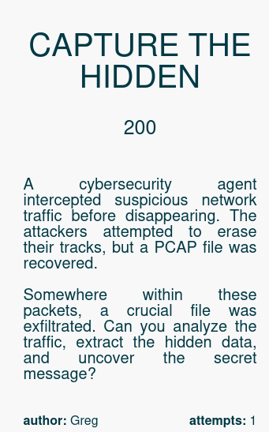
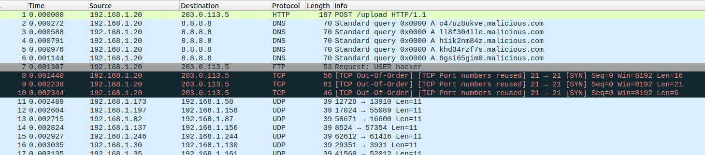
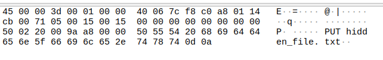
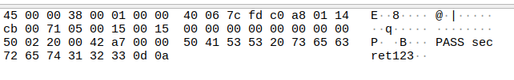
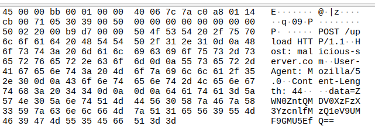
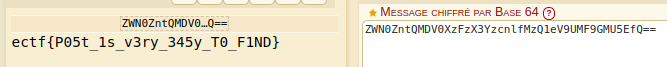

## **Étape 1 : Ouverture du fichier ZIP**

Le challenge nous fournit un **fichier ZIP** qui contient un **fichier PCAP**.

📌 **Objectif :**  
Analyser le **PCAP** pour identifier une **exfiltration de données** et récupérer le **flag**.

---

## **Étape 2 : Analyse initiale du PCAP**

J'ai ouvert le **fichier PCAP** avec **Wireshark** et commencé à analyser les paquets.

📌 **Observations principales :**

1. **Présence d’une exfiltration de données** dans le trafic réseau.
2. **Endpoints intéressants** utilisés pour transférer des fichiers.
3. **Une requête POST suspecte**.

---

## **Étape 3 : Détection de fichiers cachés**

En inspectant les paquets un par un, j'ai remarqué une **référence à un fichier** dans un paquet HTTP.

📌 **Ce que j’ai trouvé :**  
🔹 Un fichier **hidden_file.txt**  

🔹 **Un mot de passe en clair !**

---

## **Étape 4 : Exfiltration des données**

En creusant davantage, j’ai trouvé **une requête POST suspecte**.

📌 **Analyse du POST**

- Il contenait un **champ "data"** qui semblait être **une chaîne encodée en Base64**.
- J'ai extrait cette donnée et tenté de la **décoder**.

---

## **Étape 5 : Extraction du flag**

Après avoir décodé la **Base64 string**, j’ai obtenu **le flag** !

📌 **Le flag final :**

---

## **🎯 Conclusion**

🔹 **Le challenge était basé sur l’analyse d’un PCAP** pour identifier une **exfiltration de données**.

📌 **Ce challenge montre l’importance d’analyser les fichiers PCAP** pour détecter d’éventuelles **fuites de données** en cybersécurité. ✅