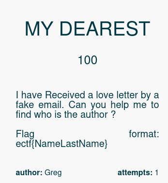
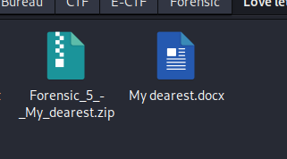
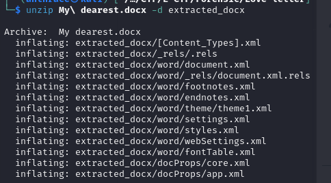
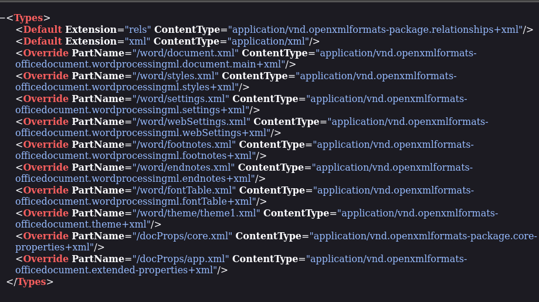
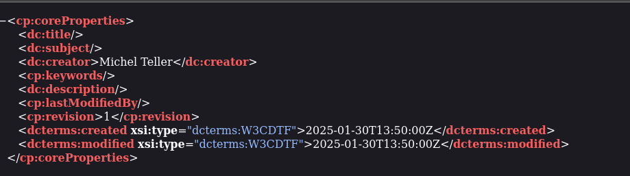

## **Étape 1 : Téléchargement du fichier ZIP**

Le challenge nous fournit un **fichier ZIP** contenant un **fichier DOCX**.

📌 **Hypothèse :**  
Un fichier **DOCX** est en réalité une **archive ZIP**, ce qui signifie qu'on peut **l'extraire** pour voir son contenu interne.

---

## **Étape 2 : Extraction du contenu du DOCX**

J’ai utilisé **unzip** pour **extraire** le contenu du **fichier DOCX**.

📌 **Résultat :**

- Plusieurs dossiers et fichiers XML.
- Un dossier **`word/`** contenant des métadonnées et du contenu.

---

## **Étape 3 : Analyse des fichiers extraits**

J’ai exploré **tous les fichiers** extraits du **DOCX**, en cherchant des informations cachées.

📌 **Ce que j’ai trouvé :**

- **Le dossier `word/` contenait du texte brut.**
- **Le fichier `docProps/core.xml` contenait des métadonnées**.

---

## **Étape 4 : Récupération de l’auteur du document**

En ouvrant le fichier **`docProps/core.xml`**, j’ai trouvé **une information clé** :  
📌 **Le nom du créateur du document** !

## **🎯 Conclusion**

🔹 **Le challenge était basé sur l’analyse d’un fichier DOCX en tant qu’archive ZIP**.  

📌 **Ce challenge montre l'importance d’examiner les fichiers bureautiques** pour détecter des informations cachées. ✅