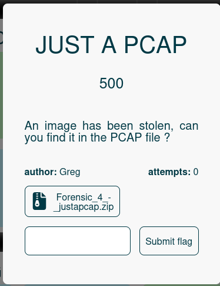
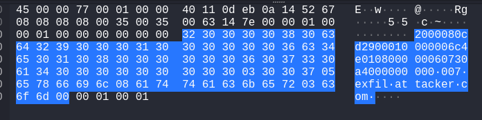
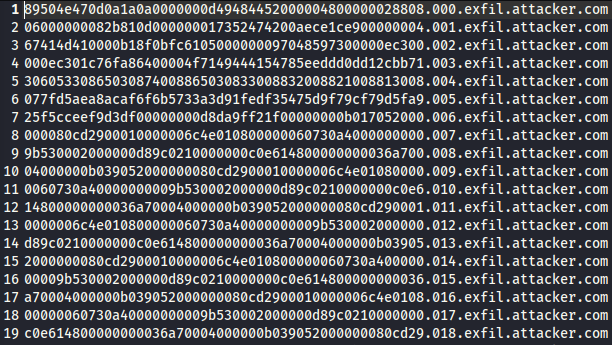
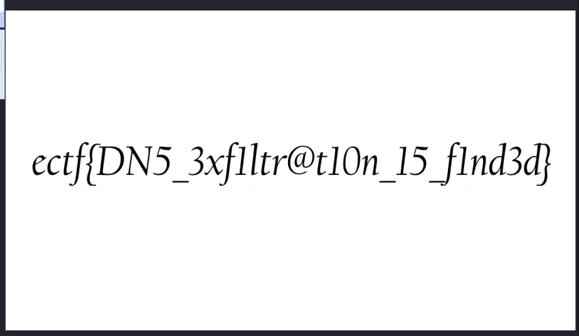

## **📌 Énoncé du challenge**



On nous donne un fichier **.zip** contenant un fichier **.pcap**. L’énoncé indique **qu’une image a été volée**, et il faut la retrouver dans le **fichier PCAP**.

---

## **🔎 Étape 1 : Analyse du fichier PCAP**

J’ai ouvert **le fichier `.pcap`** avec **Wireshark** pour inspecter les communications réseau.



📌 **Observations :**

- J’ai remarqué **des requêtes DNS suspectes** envoyées à **`data.exfil.attacker.com`**.
- Cela **suggère que l’exfiltration des données a été réalisée via DNS** en encodant l’image dans les noms de domaine.

---

## **🛠️ Étape 2 : Extraction des données exfiltrées**

Pour extraire toutes les requêtes **DNS** du PCAP, j’ai utilisé **Tshark** :

```bash
tshark -r justapcap.pcap -Y "dns" -T fields -e dns.qry.name > dns_exfil_data.txt
```

📌 **Explication :**

- `-r justapcap.pcap` → Analyse le fichier **justapcap.pcap**.
- `-Y "dns"` → Filtre uniquement les **requêtes DNS**.
- `-T fields -e dns.qry.name` → Extrait **uniquement les noms de domaine** des requêtes DNS.
- `> dns_exfil_data.txt` → Enregistre la sortie dans **un fichier texte**.

📷 **Résultat :**  



---

## **📜 Étape 3 : Nettoyage et reconstitution des données**

Les données envoyées en DNS semblaient être **encodées en hexadécimal**.  
J’ai donc utilisé **`cut`** et **`xxd`** pour reconstruire le fichier volé :


CopyEdit

```bash
cat dns_exfil_data.txt | cut -d'.' -f1 | xxd -r -p > extracted_file
```

📌 **Explication :**

- **`cut -d'.' -f1`** → Supprime **les index et le domaine `.exfil.attacker.com`**, ne gardant que l’hexadécimal.
- **`xxd -r -p`** → Convertit l’**hexadécimal en binaire**.
- **`> extracted_file`** → Stocke le **fichier reconstitué** sous le nom **`extracted_file`**.


---

## **🖼️ Étape 4 : Vérification et ouverture de l’image**

J’ai vérifié le **type de fichier extrait** avec la commande `file` et ouvert l'image:


`file extracted_file`

📌 **Résultat :**  
L’image retrouvée était bien **un fichier PNG** !

📷 **Flag récupéré :**  


---

## **🎯 Conclusion**

🔹 **Le problème :** L’image a été exfiltrée en **convertissant ses données en hexadécimal** et en les envoyant via **DNS**.  
🔹 **L’attaque :** En utilisant **Tshark** et des manipulations **shell**, j’ai pu **extraire et reconstruire l’image volée**.  
🔹 **Le résultat :** Après conversion, j’ai pu **ouvrir l’image et récupérer le flag** ! ✅
