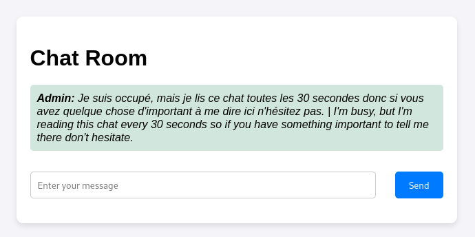
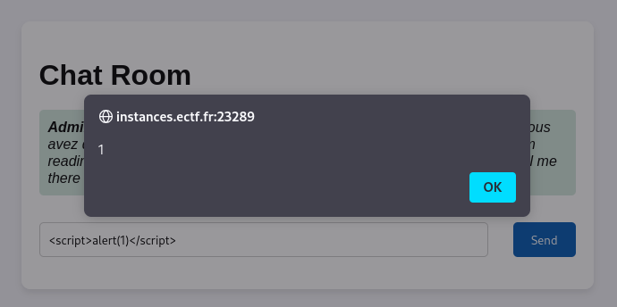
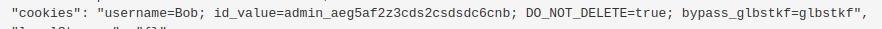
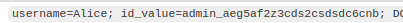
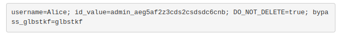

## **🎯Chatroom**

Dans ce challenge, on nous donne accès à un **chatroom** où un message explique que l’**admin lira notre message dans 30 secondes**.

🧐 Dès cette indication, je pense immédiatement à une potentielle **vulnérabilité XSS** (**Cross-Site Scripting**), car si un message est stocké et exécuté dans le navigateur de l’admin, on pourrait **injecter du JavaScript malveillant**.

---

## **🔎 Étape 1 - Tester une Injection XSS**

Pour vérifier si l’input est vulnérable au **XSS**, j’essaye un **payload simple** :

``

✅ **Résultat** : Une boîte d'alerte apparaît, ce qui confirme que mon code s’exécute bien sur la page.

---

## **🕵️‍♂️ Étape 2 - Exfiltration du Cookie de l’Admin**

Maintenant que je sais que le **XSS fonctionne**, je vais exploiter cette faille pour **voler les cookies de l'admin**.

### **💻 Payload utilisé :**

``

Ce script **envoie automatiquement** les cookies du navigateur de l’admin vers mon **endpoint webhook.site**, ce qui me permet de récupérer ses **informations de session**.

---

## **📩 Étape 3 - Récupération du Cookie de l’Admin**

Quelques secondes plus tard, je reçois une requête sur mon endpoint **avec le cookie de l'admin** :

🔑 **Contenu du cookie** :

- `username=Alice
- `id_value=adminaeg5af2z3cds2csdsdc3cnb`

---

## **🎭 Étape 4 - Changement de Session**

Avec ces informations, je modifie **mes propres cookies** dans mon navigateur pour **usurper la session de l'admin**.

---

## **🏆 Étape 5 - Accès et Récupération du Flag**

Après avoir **rechargé la page avec la session de l'admin**, je tombe directement sur le **flag** 🎉.

---

## **🚀 Conclusion**

🔹 **Problème :** Le chatroom est vulnérable à une **faille XSS stockée**.  
🔹 **Exploitation :** J’ai injecté un **script malveillant** qui **vole les cookies** de l’admin via un webhook.  
🔹 **Résultat :** En usurpant la session de l’admin, j’ai pu accéder à la page restreinte et récupérer le **flag**.

### **💡 Leçon à retenir**

✅ **Ne jamais faire confiance aux entrées utilisateur !**  
✅ **Toujours filtrer/sanitariser les inputs pour empêcher l'exécution de scripts malveillants.**