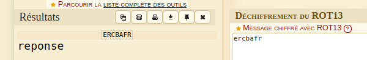
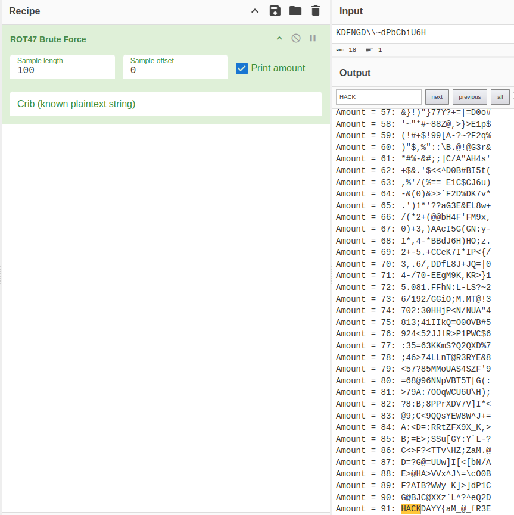
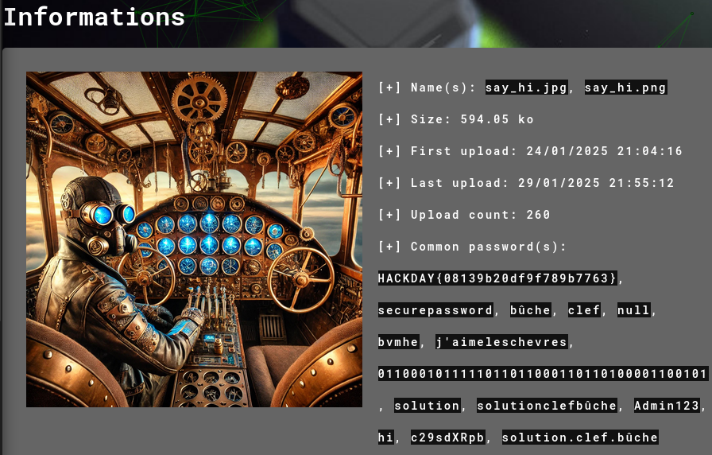
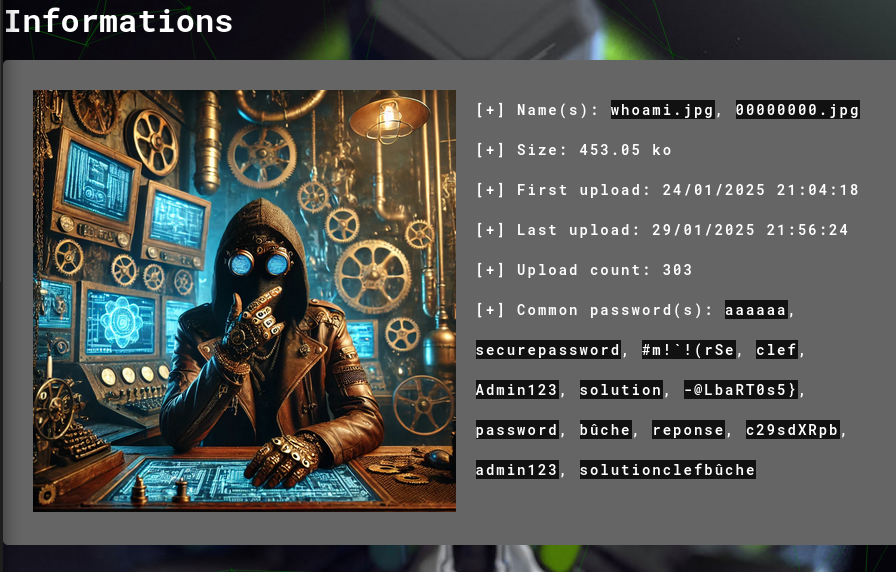

### **Forensic/Steganography Challenge - Extracting the Hidden Flag**

In this challenge, we are given a **ZIP file** containing a **log file** and **two images**.

---

### **Step 1: Analyzing the Log File**

I started by analyzing the log file, and I found **five encoded words**. I used **dcode.fr** to decode them:

- `ercbafr` (ROT13) → **reponse**

- `c29sdXRpb24=` (Base64) → **solution**

- `636c6566` (Hex to ASCII) → **clef**

- `0110001011111011011000110110100001100101` (Binary to text) → **bûche**

- `KDFNGD\\~dPbCbiU6H` → **Unknown**

For the last string, **dcode.fr couldn't decode it**, so I used **CyberChef** with a **ROT47 brute force**, which revealed:

**`KDFNGD\\~dPbCbiU6H` → `HACKDAY{aM_@_fR3E`**

---

### **Step 2: Analyzing the Two Images with Aperisolve**

Next, I analyzed the two images using **Aperisolve**.

#### **Image 1 Analysis**

Results found:

- **`HACKDAY{08139b20df9f789b7763}`**
- **`securepassword`**

#### **Image 2 Analysis**

Results found:

- **`secure password`**
- **`-@LbaRT0s5}`**

---

### **Step 3: Reconstructing the Flag**

From the extracted data, I was able to **reconstruct the second half of the flag**:

🔹 **Final flag:**  
`HACKDAY{aM_@_fR3E-@LbaRT0s5}`

---

### **Conclusion**

This challenge demonstrated the importance of **multiple forensic analysis techniques**:

- Using **dcode.fr and CyberChef** to decode text strings from logs.
- Using **Aperisolve** to extract **hidden strings and metadata** from images.
- **Piecing together** the fragments of the flag from different sources.

This approach helped uncover **the full flag hidden within encoded text and steganographic markers**.