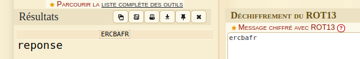
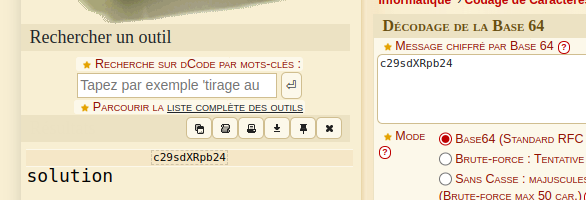
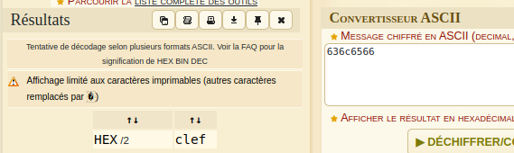
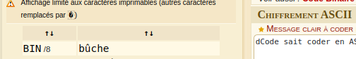
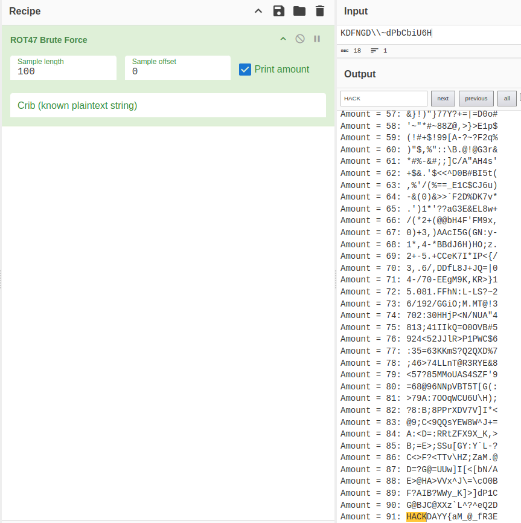
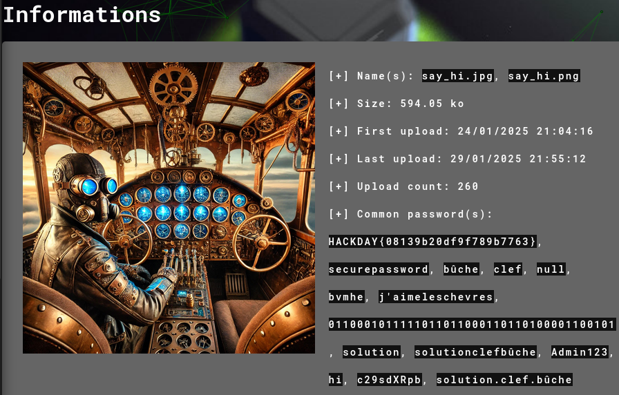
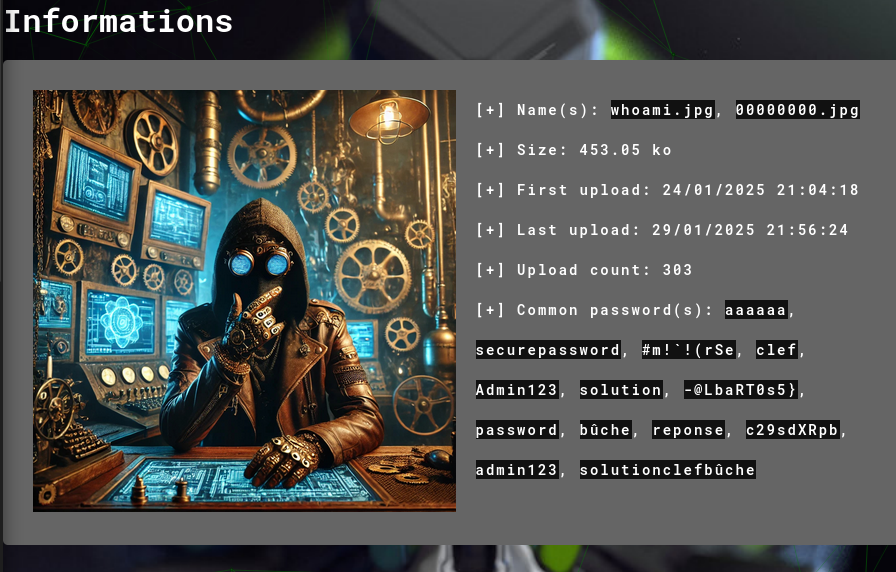

### **Challenge Forensic - Extraction du Flag Caché**

Dans ce challenge, nous avons un **fichier ZIP** contenant un **fichier de log** et **deux images**.

---

### **Étape 1 : Analyse du Fichier de Log**

J’ai commencé par analyser le fichier de log et j’ai trouvé **cinq mots encodés**. J’ai utilisé **dcode.fr** pour les décoder :

- `ercbafr` (ROT13) → **reponse**

- `c29sdXRpb24=` (Base64) → **solution**

- `636c6566` (Hexadécimal vers ASCII) → **clef**

- `0110001011111011011000110110100001100101` (Binaire vers texte) → **bûche**

- `KDFNGD\\~dPbCbiU6H` → **Inconnu**

Pour cette dernière chaîne, **dcode.fr n’a pas réussi à la décoder**, alors j’ai utilisé **CyberChef** avec une **brute force ROT47**, qui a révélé :

**`KDFNGD\\~dPbCbiU6H` → `HACKDAY{aM_@_fR3E`**

---

### **Étape 2 : Analyse des Deux Images avec Aperisolve**

Ensuite, j’ai analysé les deux images en utilisant **Aperisolve**.

#### **Analyse de l'Image 1**

Résultats trouvés :

- **`HACKDAY{08139b20df9f789b7763}`**
- **`securepassword`**

#### **Analyse de l'Image 2**

Résultats trouvés :

- **`secure password`**
- **`-@LbaRT0s5}`**

---

### **Étape 3 : Reconstruction du Flag**

Grâce aux données extraites, j’ai pu **reconstruire la deuxième partie du flag** :

🔹 **Flag final :**  
`HACKDAY{aM_@_fR3E-@LbaRT0s5}`

---

### **Conclusion**

Ce challenge démontre l'importance de **plusieurs techniques d'analyse forensic** :

- Utiliser **dcode.fr et CyberChef** pour décoder des chaînes de caractères modifiées dans les logs.
- Utiliser **Aperisolve** pour extraire des **chaînes cachées et des métadonnées** des images.
- **Assembler les différentes parties** du flag à partir de plusieurs sources.

Cette approche nous a permis de découvrir **le flag complet caché à la fois dans des textes encodés et dans des marqueurs stéganographiques**.