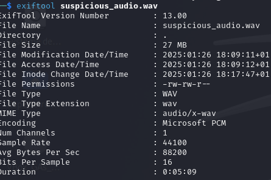
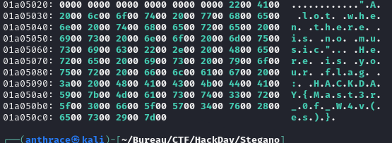

### Challenge : Analyse d’un fichier .wav pour trouver des données cachées

Dans ce challenge, nous avions un fichier `.wav` qui, à première vue, semblait être un simple fichier audio. Notre tâche consistait à analyser ce fichier et à découvrir un flag caché.

#### **Étape 1 : Écoute du fichier audio**

J’ai commencé par écouter le fichier audio. Comme prévu, rien d’anormal n’a été détecté : il sonnait comme un fichier audio classique. Cela suggérait que les informations cachées se trouvaient à l'intérieur du fichier lui-même.

---

#### **Étape 2 : Analyse des métadonnées avec `ffprobe`**

Pour extraire des métadonnées détaillées, j’ai utilisé `ffprobe` :

**Qu’est-ce que `ffprobe` ?**  
C’est un outil en ligne de commande de la suite FFmpeg, utilisé pour extraire des métadonnées et des informations techniques de fichiers multimédias.  
**Utile pour :**

- Extraire des métadonnées
- Inspecter les flux (audio, vidéo, sous-titres)
- Détecter des données cachées
- Analyser les formats de fichier
- Identifier des pièces jointes cachées

Malheureusement, la sortie ne montrait rien d’inhabituel.

---

####  **Étape 3 : Analyse des métadonnées avec `exiftool`**

Ensuite, j’ai utilisé `exiftool` pour analyser le fichier. Cet outil est conçu pour lire et manipuler les métadonnées.

**Qu’est-ce que `exiftool` ?**  
`Exiftool` est idéal pour :

- Extraire des métadonnées
- Identifier des données intégrées
- Analyser la structure des fichiers
- Révéler les fichiers modifiés
- Extraire des pièces jointes cachées
- Chercher des anomalies

Commande utilisée :

`exiftool fichier.wav`

Encore une fois, aucune découverte pertinente.

---

#### **Étape 4 : Recherche de chaînes avec `strings`**

Après l’échec des outils de métadonnées, j’ai décidé d’utiliser `strings` pour rechercher du texte lisible à l'intérieur du fichier.

**Qu’est-ce que `strings` ?**  
`Strings` est un outil qui extrait les caractères ASCII et Unicode imprimables des fichiers binaires.  
**Utile pour :**

- Extraire du texte lisible
- Rechercher des mots-clés (facilement exploitable avec `grep`)
- Révéler des données cachées
- Localiser des marqueurs de stéganographie

Malheureusement, les résultats n’ont rien révélé non plus.

---

#### **Étape 5 : Analyse binaire avec `binwalk`**

Face à ces résultats, j’ai approfondi l’analyse en utilisant `binwalk`, un outil spécialisé dans l’analyse des fichiers binaires.

**Qu’est-ce que `binwalk` ?**  
C’est un outil qui permet d'analyser les fichiers binaires et de détecter ou extraire :

- Des fichiers intégrés (images, archives, etc.)
- Des données cachées
- Des sections compressées ou chiffrées
- Des payloads stéganographiques

Commande utilisée :

`binwalk fichier.wav`

Malheureusement, aucune information pertinente n’a été extraite.

---

#### **Étape 6 : Analyse hexadécimale avec `xxd`**

Enfin, j’ai décidé d’inspecter les données brutes du fichier à l'aide de `xxd`.

**Qu’est-ce que `xxd` ?**  
`xxd` est un outil en ligne de commande qui crée un dump hexadécimal d’un fichier, permettant une inspection détaillée des données binaires.  
**Utile pour :**

- Visualiser les données brutes en formats hexadécimal et ASCII
- Rechercher des motifs ou des mots-clés
- Analyser la structure des fichiers à un niveau bas
- Inspecter des payloads stéganographiques ou des données cachées

Commande utilisée :

`xxd fichier.wav`

Après une analyse approfondie des données binaires, j’ai finalement trouvé le flag caché dans le fichier :  

---

### Conclusion

Ce challenge nécessitait une approche méthodique, utilisant divers outils pour examiner le fichier sous différents angles. Chaque étape a permis de mieux comprendre la structure du fichier, jusqu’à la découverte du flag caché dans ses données binaires. Les outils utilisés—`ffprobe`, `exiftool`, `strings`, `binwalk` et `xxd`—sont essentiels pour résoudre ce type de challenge en stéganographie et analyse forensique.