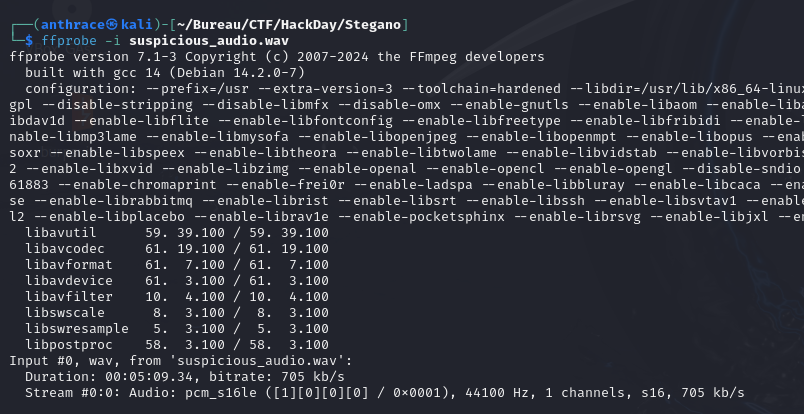
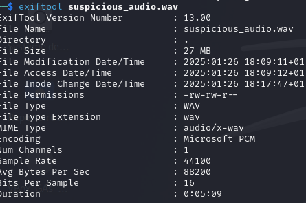
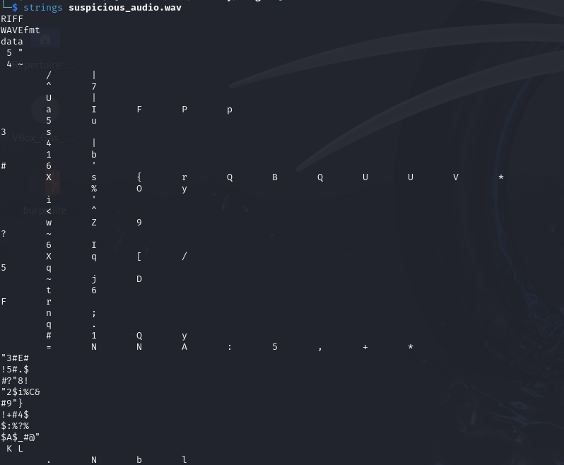
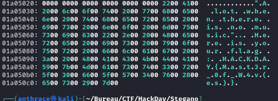

In this challenge, we are provided with a `.wav` file that, at first glance, appears to be a simple audio file. Our task is to analyze the file and uncover a hidden flag.

---

#### **Step 1: Playing the Audio**

I started by playing the audio, expecting something unusual—perhaps some hidden message or distortion—but everything sounded normal. There was no apparent clue in the audio playback.

---

#### **Step 2: Using `ffprobe` to Analyze Metadata**

To dig deeper, I used `ffprobe`, a tool from the FFmpeg suite, to extract metadata and technical details from the `.wav` file.

**What is `ffprobe`?**  
`ffprobe` is a powerful command-line utility that provides detailed metadata and insights into the structure of media files.

**Good for**:

- Extracting metadata.
- Inspecting streams (audio, video, subtitles).
- Detecting hidden data.
- Analyzing file formats.
- Identifying hidden attachments.

Unfortunately, nothing unusual was found in the metadata.

---

#### **Step 3: Using `exiftool` for Further Metadata Analysis**

Next, I used `exiftool` to analyze the file further, hoping to uncover hidden data or anomalies.

**What is `exiftool`?**  
`exiftool` is a command-line tool designed to extract and manipulate metadata from files like images, audio, and videos.

**Good for**:

- Extracting metadata.
- Identifying embedded data.
- Analyzing file structures.
- Revealing edits or manipulations.
- Extracting hidden attachments.
- Searching for anomalies.

Unfortunately, even `exiftool` revealed nothing suspicious.

---
#### **Step 4: Extracting Strings with `strings`**

Since metadata analysis didn’t yield results, I moved on to search for hidden information in printable characters using `strings`.

**What is `strings`?**  
`strings` is a simple command-line tool that extracts printable ASCII and Unicode characters from binary files.

**Good for**:

- Extracting printable characters.
- Searching for keywords (grep-friendly).
- Revealing hidden data.
- Locating steganographic markers (some tools leave identifiable markers in files).

**Output**: 

Despite scanning for keywords and hidden data, there was no luck with `strings`.

---
#### Step 5: Binary Analysis with Binwalk

Still empty-handed, I decided to dig deeper into the binary structure using `binwalk`.

**What is `binwalk`?**  
`binwalk` is a tool for analyzing binary files to detect and extract:

- Embedded files (e.g., images, archives)
- Hidden data
- Compressed or encrypted sections
- Steganographic payloads

Command used:
`binwalk file.wav`

However, even `binwalk` failed to provide any significant clues:  

#### Step 6: Hexadecimal Analysis with `xxd`

Finally, I decided to inspect the file’s raw binary data using `xxd`.

**What is `xxd`?**  
`xxd` creates a hexadecimal dump of a file, allowing detailed inspection of binary content.  
**Good for:**

- Viewing raw data in hex and ASCII formats
- Searching for patterns or keywords
- Analyzing file structure at a low level
- Inspecting steganographic payloads or hidden data

Command used:
`xxd file.wav | less`

After carefully analyzing the binary data, I finally discovered the flag embedded deep within the file:  

---

### Conclusion

This challenge required a systematic approach, exploring the file using multiple tools to uncover hidden data. Each step provided more insight into the file’s structure, leading me to the embedded flag in the end. The tools used—`ffprobe`, `exiftool`, `strings`, `binwalk`, and `xxd`—demonstrate the importance of using diverse methodologies in forensic and steganographic challenges.