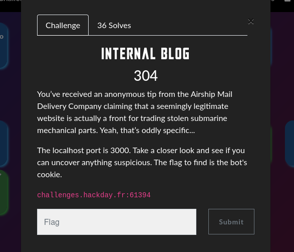
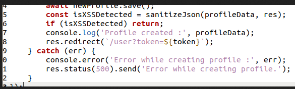

### **Exploiting an XSS Vulnerability in a Blog with Moderator Visit**

In this challenge, we have a blog with a user registration and login system.  
We know that the **admin (or the moderator bot) will visit our profile** when we register and when we post an article.

A **source code leak** is also available.

---

### **Step 1: Analyzing the Source Code**

Looking at the leaked source code, we notice an **attempt at sanitization** of the fields, but it is performed **after the .save()**, meaning that **even if an error is displayed, the data is already stored in the database**.

The moderator will **visit our profile** after we create an account and post an article.

---

### **Step 2: Testing a Basic XSS Injection**

I first tried a simple XSS payload:

``

But an error was displayed:

---

### **Step 3: Identifying the Vulnerable Field**

I tested different payloads by creating multiple accounts to determine **which field is exploitable**.

After obtaining a registration token, I accessed my profile via `/user?token=$token`.

Result: An `alert(2)` is displayed, **confirming that the name field is vulnerable**.

---

### **Step 4: Exploiting the Vulnerability to Steal Cookies**

Now that we know the `name` field is exploitable, we will inject an XSS payload to steal the moderator's cookie.

Payload used:

``

We register an account with this **payload in the name field**, and wait for the moderator to visit our profile.

The payload is executed, redirecting to our **webhook**, which captures the moderator's cookie.

---

### **Step 5: Creating an Article to Finalize the Attack**

To maximize our chances of execution, we also create a blog post with the same payload.

After a while, we check our **webhook endpoint**, and **the cookie containing the flag is captured!**

🔗 **Webhook URL with the retrieved flag:**  
https://webhook.site/66a3fb27-4a91-4cae-8c0e-a5f9dd8385e1?cookie=FLAG=HACKDAY{0rd3R_M4tteRs_In_Ur_C0d3!!!!}

---

### **Conclusion**

This challenge demonstrates the importance of **proper operation ordering** in a web application's code.  
Here, **sanitizing inputs after storing them** allowed us to exploit a **stored XSS vulnerability**, leading to **complete compromise** via the moderator's session theft.

➡ **Protection against this type of attack:**

- Always **sanitize and validate inputs before storing them**.
- Enable `HttpOnly` on cookies to prevent theft via JavaScript.
- Use **Content Security Policy (CSP)** to limit the execution of malicious scripts.
- Implement **strict filters** on user input fields.