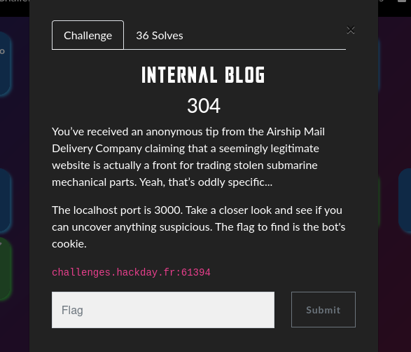
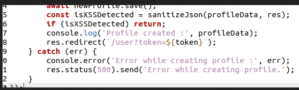
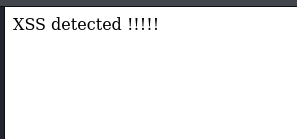
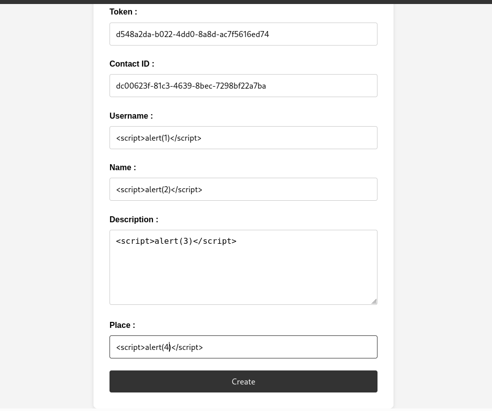
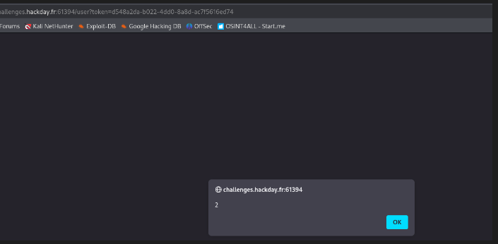
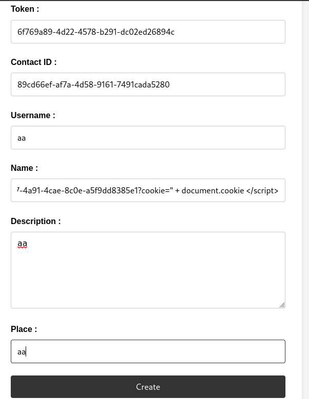

### **Exploitation d'une faille XSS dans un blog avec visite de modérateur**

Dans ce challenge, on a un blog avec un système d'enregistrement et de connexion des utilisateurs.  
On sait que l'**admin (ou le bot modérateur) visitera notre profil** lorsqu'on s'enregistre et lorsqu'on poste un article.

Un **leak du code source** est également présent.

---

### **Étape 1 : Analyser le code source**

En regardant le leak de code, on remarque une **tentative de sanitization** des champs, mais celle-ci est effectuée **après le `.save()`**, ce qui signifie que **même si une erreur s'affiche, les données sont déjà enregistrées en base**.

Le modérateur va **visiter notre profil** après la création du compte et l'ajout d'un article.

---

### **Étape 2 : Tester une première injection XSS**

J'ai d'abord essayé un payload XSS basique :

``

Mais une erreur s'affiche :

---

### **Étape 3 : Déterminer quel champ est vulnérable**

J'ai testé différents payloads en créant plusieurs comptes pour identifier **le champ exploitable**.

Après avoir obtenu un token d'enregistrement, j'ai accédé à mon profil via `/user?token=$token`.

Résultat : Un `alert(2)` s'affiche, **confirmant que le champ `name` est vulnérable**.

---

### **Étape 4 : Exploiter la faille avec un vol de cookie**

Maintenant que l'on sait que le champ `name` est exploitable, nous allons injecter un payload XSS pour voler le cookie du modérateur.

Payload utilisé :

``

Nous enregistrons un compte avec ce **payload dans le champ `name`**, et attendons que le modérateur visite notre profil.

Le payload est exécuté, et redirige vers notre **webhook** qui capture le cookie du modérateur.

!

---

### **Étape 5 : Création d'un article pour finaliser l'attaque**

Pour maximiser nos chances d'exécution, nous créons également un article sur le blog avec le même payload.

[Screenshot](images/blog_article.png)

Après un moment, nous vérifions notre **endpoint webhook**, et **le cookie contenant le flag est capturé !**

🔗 **URL du webhook avec le flag récupéré :**  
`https://webhook.site/66a3fb27-4a91-4cae-8c0e-a5f9dd8385e1?cookie=FLAG=HACKDAY{0rd3R_M4tteRs_In_Ur_C0d3!!!!}`

---

### **Conclusion**

Ce challenge démontre l'importance d'un **bon ordre des opérations** dans le code d'une application web.  
Ici, la **sanitization des entrées après enregistrement** a permis d'exploiter un **XSS stored**, ce qui a conduit à une **compromission totale** via le vol de session du modérateur.

➡ **Protection contre ce type d'attaque :**

- Toujours **sanitiser et valider les entrées avant de les enregistrer**.
- Activer `HttpOnly` sur les cookies pour éviter leur vol via JavaScript.
- Utiliser **Content Security Policy (CSP)** pour limiter l'exécution de scripts malveillants.
- Mettre en place des **filtres stricts** sur les champs utilisateur.