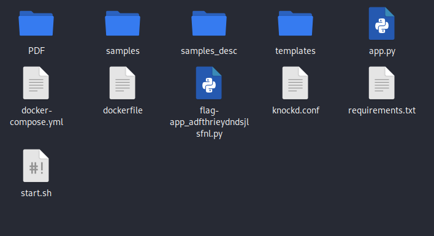
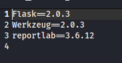
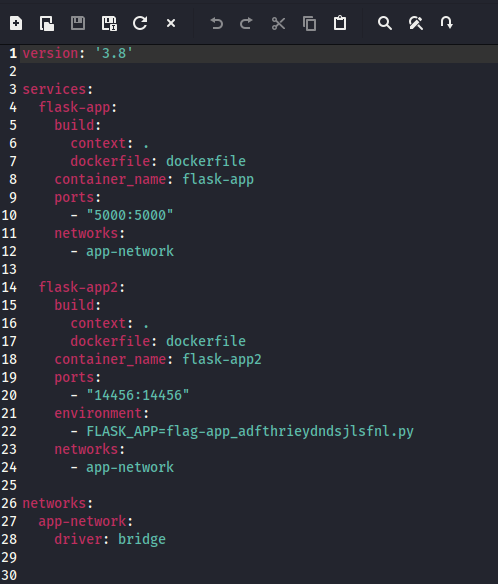
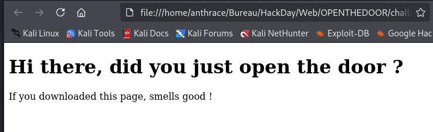
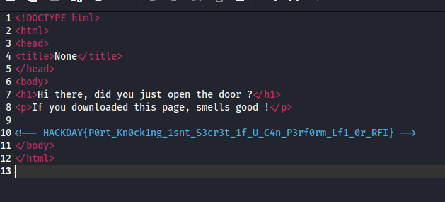

### **Flask Web Challenge - Template Injection Analysis**

In this challenge, we have a downloadable folder containing several files.

---

### **Step 1: Identifying the Web Framework**

By examining the `requirements.txt` and `app.py` files, we confirm that the application is built using **Flask**.

---

### **Step 2: Examining the Docker Configuration**

Looking into the `docker-compose.yaml` file, we notice that the application is using **templates** as an environment variable, which could be a potential security risk.

---

### **Step 3: Accessing the Template in the Browser**

By navigating to the template in a web browser, we confirm that the application is rendering content dynamically.

---

### **Step 4: Inspecting the Template Code in an IDE and Extracting the Flag**

Opening the template in an IDE allows us to analyze its structure.

After analyzing the template, we find that **the flag is commented within the template file**.

This suggests a misconfiguration where sensitive data was left exposed in the source code.

---

### **Conclusion**

This challenge highlights the importance of **code review** and **secure template rendering**. Sensitive information should never be hardcoded or left in templates, even in comments, as it can be easily retrieved. Proper security measures, like environment variables and access restrictions, should be in place to avoid such leaks.