## **📌 Description du Challenge**

Dans ce challenge, il y a un formulaire où l'on doit soumettre des tokens.  
L'énoncé et les indices indiquent que plusieurs tokens sont cachés à différents endroits de l'application web.  
L'objectif est de **trouver et soumettre tous les tokens pour obtenir le flag**.

---

## **🛠️ Étape 1 : Comprendre où chercher les tokens**

Les tokens sont dispersés dans plusieurs endroits classiques où des informations cachées peuvent être stockées :

1. **HTML**
2. **Console (JavaScript log)**
3. **CSS**
4. **JavaScript (fichier externe)**
5. **Headers HTTP**
6. **Cookies**
7. **robots.txt**
8. **sitemap.xml**
9. **Requêtes HTTP spécifiques**
10. **Fichiers accessibles via le serveur**

---

## **🔍 Étape 2 : Recherche des Tokens un par un**

### **📝 1️⃣ Premier Token - Dans le formulaire**

Le premier token nous est directement donné dans le formulaire :

`B218B51749AB9E4C669E4B33122C8AE3`

---

### **📝 2️⃣ Deuxième Token - Caché en commentaire dans le HTML**

En inspectant le code source de la page avec **Ctrl + U** ou via l'onglet **Elements** dans les DevTools du navigateur, on trouve un commentaire :

`<!-- Token: 66E7AEBA46293C88D484CDAB0E479268 -->`

---

### **📝 3️⃣ Troisième Token - Console.log**

Dans l'onglet **Console** des DevTools (F12 → Console), on voit un log contenant un token :

`5D1F98BCEE51588F6A7500C4DAEF8AD6`

---

### **📝 4️⃣ Quatrième Token - Fichier CSS**

En allant dans **Sources** → **Fichiers CSS** et en cherchant dans le fichier **styles.css**, un token y est dissimulé :

`29D3065EFED4A6F82F2116DA1784C265`

---

### **📝 5️⃣ Cinquième Token - Fichier JavaScript**

Dans le fichier **main.js**, accessible via **Sources**, un autre token est visible :

`9D34859CA6FC9BB8A57DB4F444CDAE83`

---

### **📝 6️⃣ Sixième Token - Headers HTTP**

On utilise **l'onglet Network** dans les DevTools, puis on recharge la page. En analysant les **en-têtes de requêtes HTTP**, un token est trouvé dans un header :

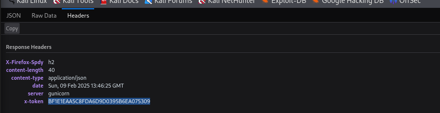

`BF1E1EAA5C8FDA6D9D0395B6EA075309`

---

### **📝 7️⃣ Septième Token - Cookie**

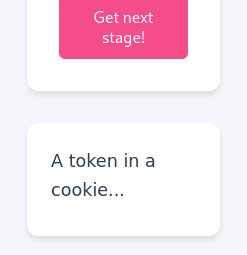

En allant dans **Application → Cookies**, un autre token est trouvé :

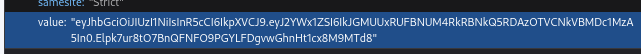

`647E67B4A8F4AA28FAB602151F1707F2`

---

### **📝 8️⃣ Huitième Token - robots.txt**

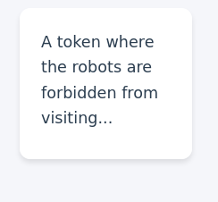

Les fichiers **robots.txt** sont souvent accessibles à `https://site.com/robots.txt`.  
En le consultant, on trouve un autre token :

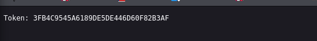

`3FB4C9545A6189DE5DE446D60F82B3AF`

---

### **📝 9️⃣ Neuvième Token - sitemap.xml**

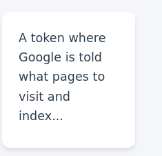

Comme mentionné dans l’indice, nous avons cherché **sitemap.xml** (`https://site.com/sitemap.xml`) et trouvé un autre token :

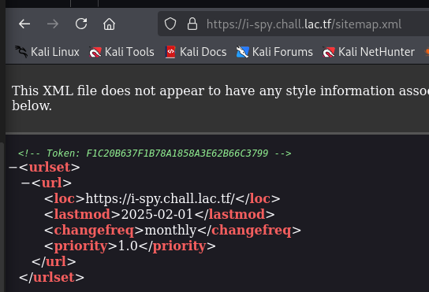

`F1C20B637F1B78A1858A3E62B66C3799`

---

### **📝 🔟 Dixième Token - Suppression d’un élément**

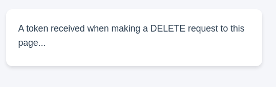

Dans l'interface de l'application, une option de suppression semble révéler un token.  
Après avoir tenté un **DELETE**, nous avons obtenu :

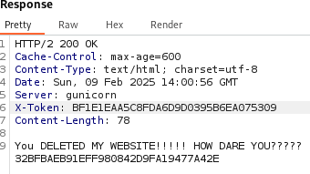

`32BFBAEB91EFF980842D9FA19477A42E`

---

### **📝 1️⃣1️⃣ Onzième Token - NSLOOKUP**

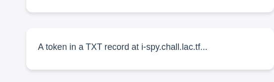

Nous avons utilisé **nslookup** sur le domaine cible, ce qui nous a révélé un fichier texte accessible, contenant le dernier token :

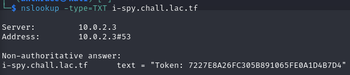

---

## **🎯 Étape 3 : Soumission des Tokens**

Une fois tous les tokens récupérés, nous les avons soumis dans le formulaire, ce qui nous a permis d'obtenir **le flag**.

---

## **🏆 Flag Final**

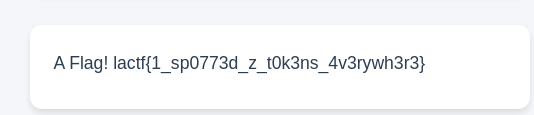

---

## **🛡️ Conclusion**

- Ce challenge était une **chasse au trésor** des tokens cachés dans des emplacements souvent négligés.
- Il met en avant **l’importance de vérifier toutes les sources possibles d’informations sensibles** sur une application web.
- **Bonne pratique :** Évitez d’exposer des données sensibles dans les commentaires, headers, cookies ou fichiers accessibles.

💡 **Toujours inspecter une application sous tous les angles pour découvrir des vulnérabilités potentielles !**