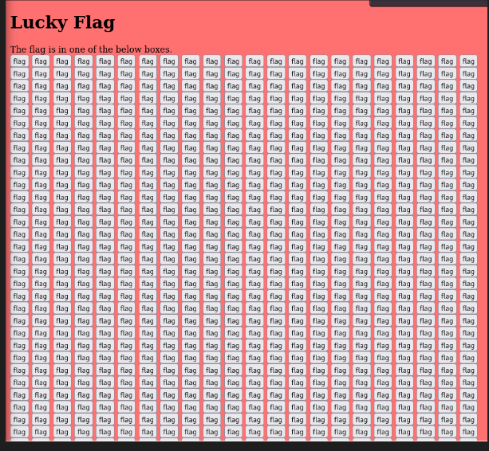
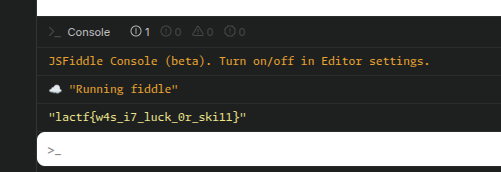

## **📌 Description du challenge**

Dans ce challenge, je suis face à une **page web remplie de milliers de boutons** portant tous l’étiquette "flag".  



L'objectif est de **trouver le bon bouton qui affiche le flag**.

---

## **🔍 Étape 1 : Inspection du code source**

Plutôt que de cliquer sur **des milliers de boutons** je trouve un fichier **`main.js`** qui gère le fonctionnement des boutons.

---

## **📝 Étape 2 : Analyse du fichier `main.js`**

### **1️⃣ Observations importantes**


```javascript
 const boxes = document.querySelectorAll('.box');
let flagbox = boxes[Math.floor(Math.random() * boxes.length)];
```

- Le script **choisit un bouton au hasard** (`flagbox`) parmi tous les boutons (`boxes`).
- Si on clique sur **le bon bouton**, il révèle le flag.

```javascript
for (const box of boxes) {
    if (box === flagbox) {
        box.onclick = () => {
            let enc = `"\\u000e\\u0003\\u0001\\u0016\\u0004\\u0019\\u0015V\\u0011=\\u000bU=\\u000e\\u0017\\u0001\\t=R\\u0010=\\u0011\\t\\u000bSS\\u001f"`;

            for (let i = 0; i < enc.length; ++i) {
                try {
                    enc = JSON.parse(enc);
                } catch (e) {
                    break;
                }
            }

            let rw = [];
            for (const e of enc) {
                rw.push(e.charCodeAt(0) ^ 0x62);
            }

            const flag = rw.map(x => String.fromCharCode(x)).join('');
            alert(`Congrats ${flag}`);
        };
    } else {
        box.onclick = () => alert('no flag here');
    }
}
```

### **2️⃣ Comment le flag est caché ?**

- La variable `enc` contient **le flag encodé sous forme de séquences Unicode**.
- Le script **décodifie** `enc` grâce à `JSON.parse(enc)`, convertissant les séquences Unicode en texte brut.
- Chaque caractère de `enc` a été **chiffré avec un XOR `0x62` (98 en décimal)** pour masquer le vrai flag.
- La fonction **applique à nouveau le XOR `0x62`** pour retrouver le flag original.

---

## **💡 Étape 3 : Extraction du flag**

Plutôt que de **cliquer sur chaque bouton**, j’ai exécute sur JsFiddle du code pour de trouver la flag.


### **1️⃣ Déchiffrement avec JavaScript**


```javascript
let enc = `"\\u000e\\u0003\\u0001\\u0016\\u0004\\u0019\\u0015V\\u0011=\\u000bU=\\u000e\\u0017\\u0001\\t=R\\u0010=\\u0011\\t\\u000bSS\\u001f"`;

for (let i = 0; i < enc.length; ++i) {
    try {
        enc = JSON.parse(enc);
    } catch (e) {
        break;
    }
}

let rw = [];
for (const e of enc) {
    rw.push(e.charCodeAt(0) ^ 0x62);
}

const flag = rw.map(x => String.fromCharCode(x)).join('');
console.log(flag);
```

### **2️⃣ Résultat**


`lactf{w4s_i7_luck_0r_ski11}`

---

## **🏆 Conclusion**

✅ **Le challenge reposait sur un flag caché dans un script JavaScript et chiffré avec un simple XOR.**  
✅ **Plutôt que de cliquer aléatoirement, j’ai analysé `main.js` et compris comment il générait le flag.**  
✅ **En exécutant directement le code de déchiffrement dans la console du navigateur, j’ai obtenu la flag instantanément.**

Moralité : **Toujours inspecter le code source avant d’essayer une solution fastidieuse !** 🔍💡