# Operation Silent Hunt

## Challenge Description

> During the theft of a hard drive containing sensitive data, the attacker made a mistake: they lost their phone at the scene.  
> **Your mission:** follow the clues and locate the **exact address** where the hard drive is hidden.  
>
> But be careful... getting caught could compromise the entire operation.  
>
> 🔍 Only use the following websites for your investigation:
>
> - [Google](https://www.google.com/)
> - [YouTube](https://www.youtube.com/)
> - [Pinterest](https://fr.pinterest.com/)
> - [Google Maps](https://www.google.com/maps)
> - [X (Twitter)](https://x.com/)
> - [Instagram](https://www.instagram.com/)
> - [GitHub](https://github.com/)
> - [Reddit](https://www.reddit.com/)
> - [LinkedIn](https://linkedin.com/)
>
> 📱 Virtual Phone: [https://message-app.midnightflag.fr/](https://message-app.midnightflag.fr/)  
> 🔐 Format of the flag: `MCTF{housenumber_street_city}` (all lowercase)  
> 💡 Example: `MCTF{66_rue_des_fleurs_paris}`

---

## Step 1: The Virtual Phone

We start the challenge with a **virtual phone** that’s locked. To unlock it, we need to find the correct code.

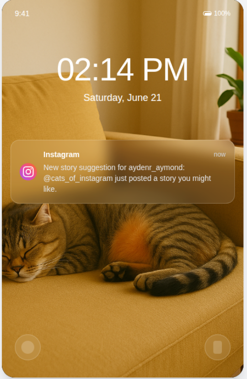  
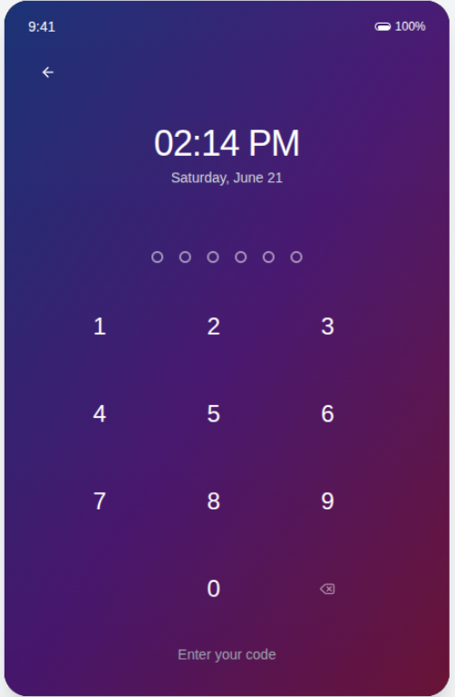

The first thing we notice is some **information about an Instagram account**. This could be a clue.

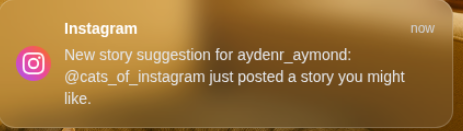  
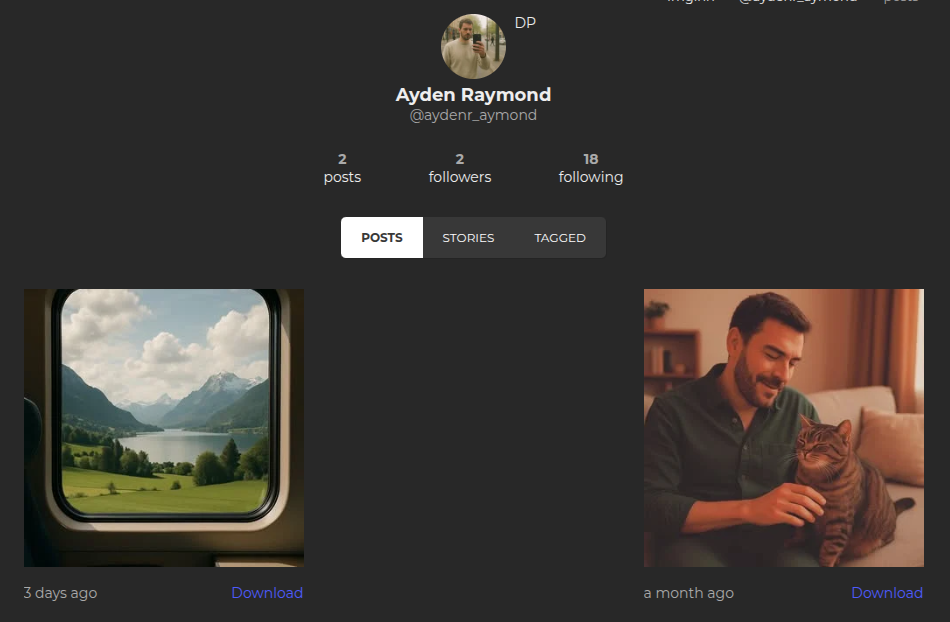

Looking closely at the photos, we can spot **patterns** that could potentially be part of the phone's unlock code.

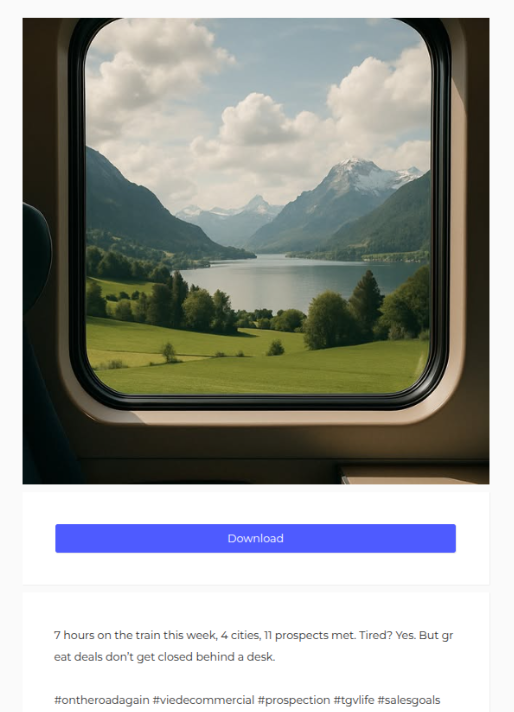  
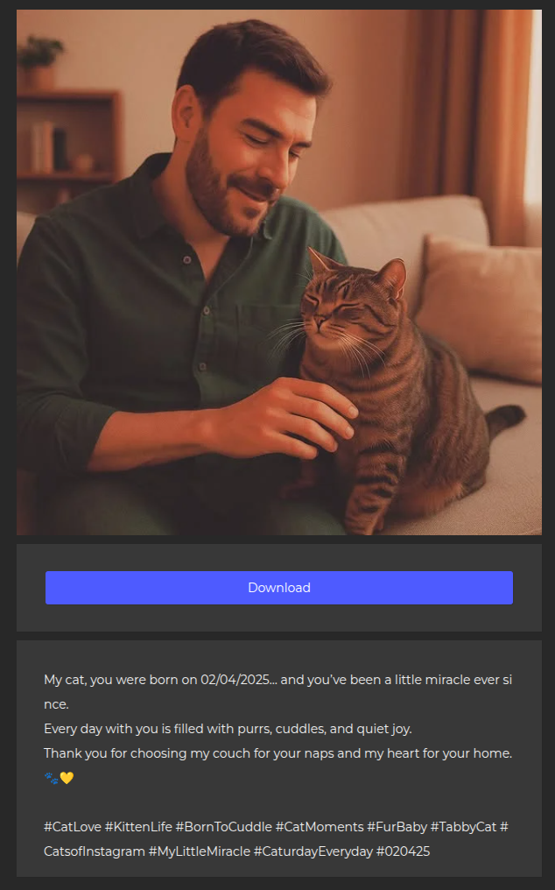

Since the user seems emotionally attached to their **cat**, I noticed a **date** in one of the photos.

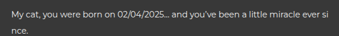

I tried using this as the unlock code:

```text
020425
```

✅ It worked — the phone is now **unlocked**!

---

## Step 2: The Chat App

As soon as we access the phone, a **conversation** appears.

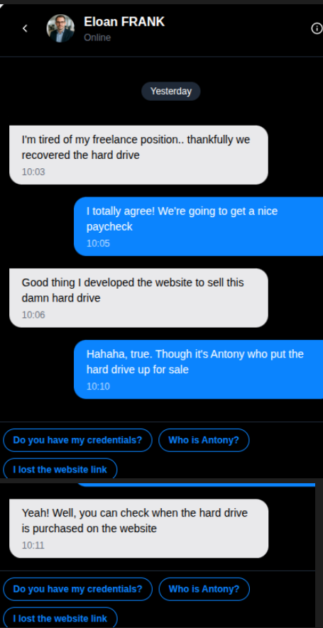

I tried several inputs, and eventually, by choosing "**I lost the website link**", I received a **URL** as a reply.

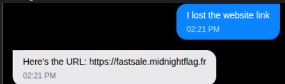

When we try to access the site, we're asked for **credentials**. One of the questions is the **name of the cat**.

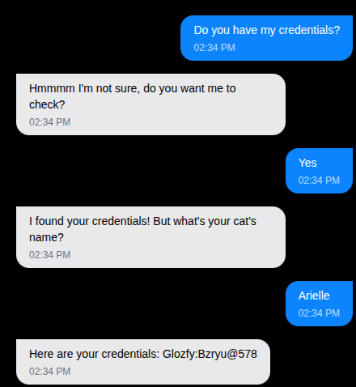

Luckily, we saw that earlier in the photos the user shared with **Eloan FRANK**. We can see the **cat’s name** there.

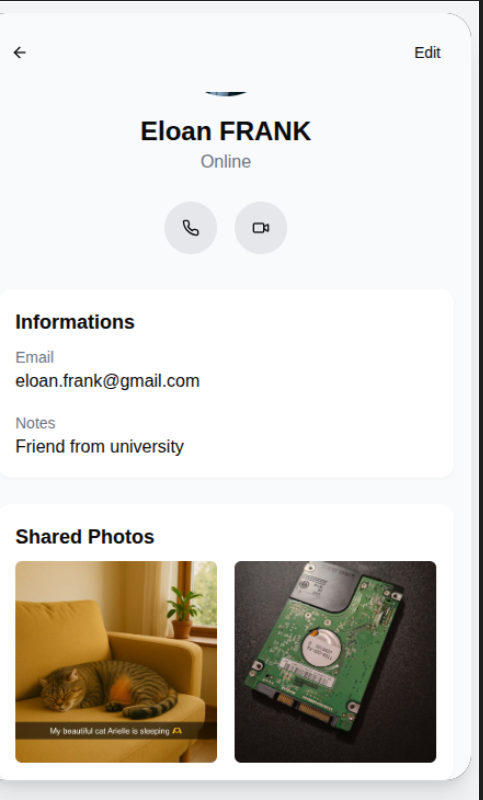  
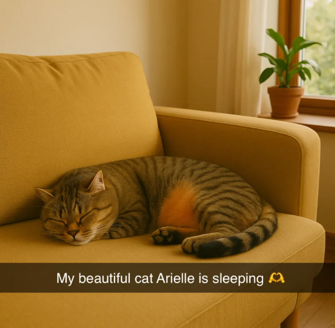

Using this, we successfully **log in** to the website where the hard drive was being sold.

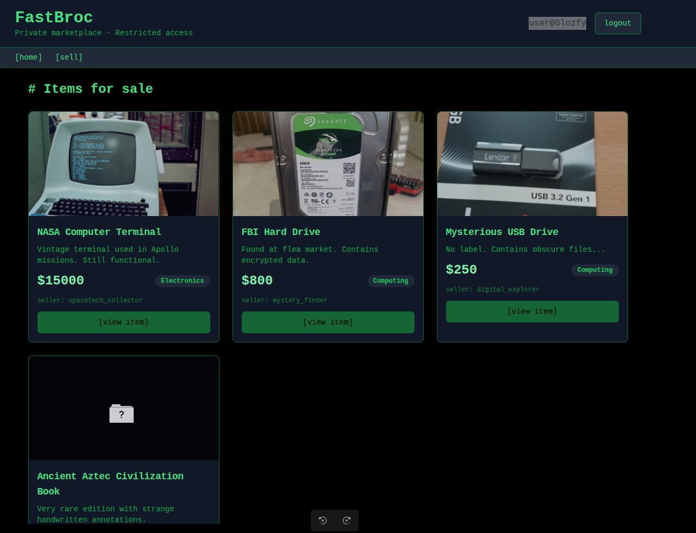

---

## Step 3: Finding the Buyer

While inspecting the site, I checked the **JSON data** loading the product and noticed the buyer’s nickname:

```js
{
  id: 5,
  title: "External Hard Drive",
  description: "2TB external hard drive",
  price: 2e5,
  seller: "tech_seller",
  buyer: "Darkythedark42",
  deliveryDate: "22/06/2025 at 16:00",
  image: "/External_Hard_Drive.webp"
}
```

This led me to an **X (Twitter)** account:  
👉 [https://x.com/Darkythedark42](https://x.com/Darkythedark42)

The account only had **one post**:

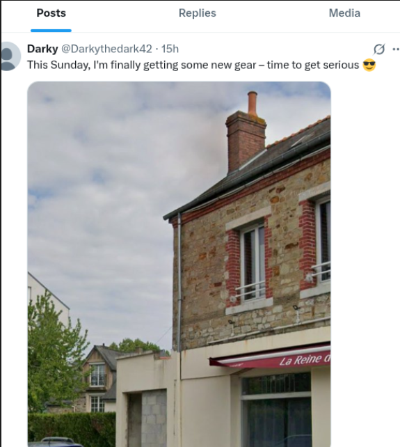

Trying to figure out the **location**, I noticed the **first letters** of a **place name** in the image.

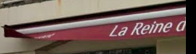

I ran a **Google Reverse Image Search**, and something looked familiar…

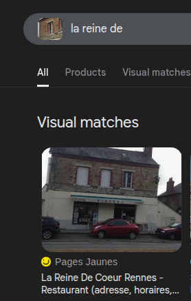

We're playing the CTF from **Rennes**, so it wouldn't be surprising if the location were nearby.

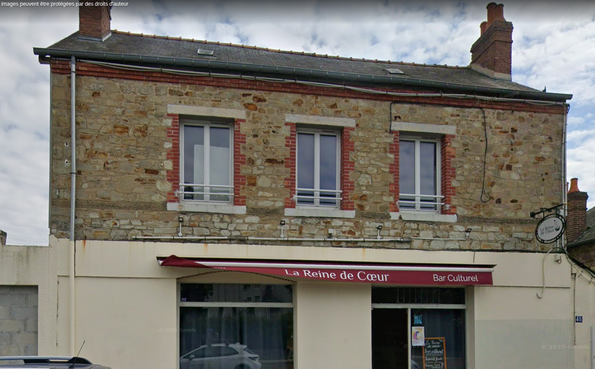

---

## Step 4: The Final Flag

After matching the location on Google Maps, I finally found the **street name and house number**.

✅ **Flag:**

```text
MCTF{48_rue_de_saint-brieuc_rennes}
```