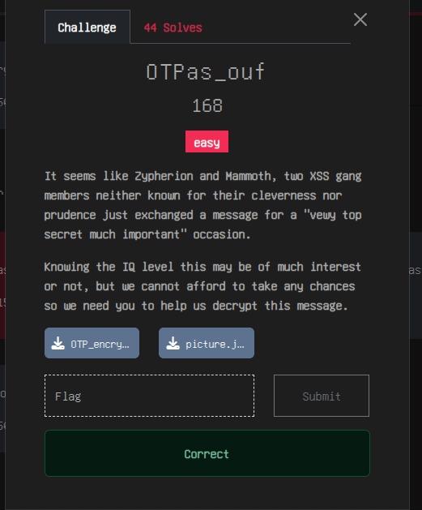
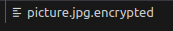

# Overview of the Challenge
In this challenge we are given a Python script that performs a one-time pad (OTP) encryption on a file and a crypted file.

Here’s what happens:
### 1.OTP Generation:
A 10-byte pad is generated using random bytes.
```python
def generate_OTP():
    OTP = b''
    for _ in range(10):
        # Generates a random byte (0–255) and appends it to the OTP.
        OTP += int.to_bytes(randint(0,255), 1, 'big')
    return OTP
```

### 2.File Encryption:
The script reads the input file in binary mode and encrypts it by XORing  each byte with a corresponding byte from the OTP (repeating the OTP cyclically).

```python
def encrypt_file(input_file: str, output_file: str, passwd: bytes):
    with open(input_file, "rb") as ifile:
        input_data = ifile.read()

    with open(output_file, 'wb') as ofile:
        # XOR each byte with the OTP (repeated every 10 bytes)
        buffer = bytes([(input_data[k] ^ passwd[k % len(passwd)]) 
                        for k in range(len(input_data))])
        ofile.write(buffer)
```

### 3.Challenge Setup:
The twist in this challenge is that, although a one-time pad is generally secure when used correctly, reusing a short pad makes it vulnerable. In our case, we know that the encrypted file is a JPEG image. JPEG files always start with a standard header, meaning that the first 10 bytes of the file are known. A typical JPEG header starts with:
## Why the Encryption is Vulnerable
The encryption process uses a short, repeated OTP (only 10 random bytes). If we have access to part of the original plaintext, we can recover those 10 bytes by XORing the known plaintext with the encrypted ciphertext.

And guess what? We actually know the first 10 random bytes! Thanks to Zhyperion and Mammoth not being the sharpest tools in the shed ;)



Thanks to the name of the image we know we are dealing with a .jpg, ergo we have the first 10 random bytes

JPEG files have a standard header. A typical JPEG header begins with the following bytes:

* Byte 0: 0xFF

* Byte 1: 0xD8
 
* Byte 2: 0xFF
 
* Byte 3: 0xE0
 
* Byte 4: 0x00
 
* Byte 5: 0x10
 
* Byte 6: 0x4A
 
* Byte 7: 0x46
 
* Byte 8: 0x49
 
* Byte 9: 0x46

Since the encryption is done with XOR (which is its own inverse), we can recover the OTP for these 10 bytes by XORing the encrypted file's first 10 bytes with the known header.

So, following this logic I crafter a script to help me decrypt the file:

```python
jpeg_header = bytes([0xFF, 0xD8, 0xFF, 0xE0, 0x00, 0x10, 0x4A, 0x46, 0x49, 0x46])
file = "picture.jpg.encrypted"

encrypted_file = file 
with open(encrypted_file, "rb") as f:
    encrypted_data = f.read()


otp = bytes([encrypted_data[i] ^ jpeg_header[i] for i in range(10)])

decrypted_data = bytes([encrypted_data[k] ^ otp[k % 10] for k in range(len(encrypted_data))])

decrypted_file = "image3.jpg"
with open(decrypted_file, "wb") as f:
    f.write(decrypted_data)

print("done")   
```
When this script is executed, the decrypted image file is produced. The flag is revealed within this image.


